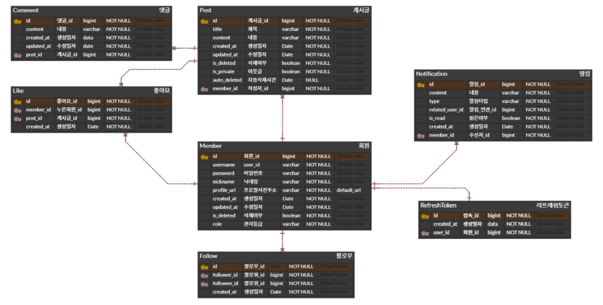

# LTE (Log To Everyone)

> 소통을 위한 SNS 사이트

## 구현

구현 요구사항

## 1. 인증 방식

- Spring Security 기반의 JWT 인증 방식을 채택한다.
- AccessToken + Refresh Token을 사용한 인증 방식을 채택한다.
- Token 에는 식별자 번호와 닉네임이 저장된다.

## 2. 회원

### 회원가입 및 수정

- 사용자는 회원가입 시 ID, PASSWORD, 닉네임, 프로필 사진 (선택)을 입력해야한다.
    - ID는 최소 5자에서 최대 10자이며 알파벳 대소문자와 숫자만 입력 가능하다.
    - PASSWORD는 최소 6자에서 최대 15자이며 알파벳 대소문자와 숫자, 특수문자만 입력 가능하다. PASSWORD 에는 알파벳, 숫자, 특수문자가 포함 되어야한다.
    - 닉네임은 최소 3글자에서 최대 6자이며 알파벳, 한글, 슷자만 입력 가능하다.
- ID와 닉네임은 타인과 중복 불가능하다.
- 닉네임과 PASSWORD는 수정 가능하다.
- 프로필 사진은 설정하지 않을 경우 기본 사진이며, 추가 시 변경된다.
- 계정 삭제는 Soft Delete로 동작한다.
- 계정을 삭제할 시 팔로우 관련 데이터가 모두 삭제된다.

## 3. 게시글

### 게시글 관리

- 게시글 등록 시 제목, 내용을 입력 가능하다. (추후 이미지 도입)
    - 제목은 최소 한 글자 이상 작성 해야한다.
    - 제목은 30자 이내로 작성해야한다.
    - 내용은 비어있으면 안되지만, 공백으로 채워진 내용은 허용한다.
- 제목과 내용은 수정 가능하다.
- 게시글 등록 날짜는 최초 등록 날짜 기준이다.
- 작성자는 현재 시간 이후로 게시글 자동 삭제 기능을 추가할 수 있다.
    - 자동 삭제 시간은 등록 시간 이후어야한다.
    - 자동 삭제는 년,월,일,시,분으로 등록 가능하다.
- 게시글 등록 시 팔로위만 보기 기능을 추가할 수 있다.
    - 자신이 팔로우한 사람만 해당 게시글을 조회할 수 있다.
- 게시글을 조회할 시 조회수가 증가한다.
- 게시글을 추천할 시 추천수가 증가한다.
- 추천은 멤버마다 각 게시글당 1회만 가능하다.
- 게시글은 삭제 가능하다. (Soft Deleted)

### 게시글 조회

- 게시글 검색은 작성자 닉네임, 게시글 제목으로 검색 가능하다.
    - 검색 내용 일부만 포함되어도 검색 된다.
- 게시글 정렬은 최신 등록일, 최다 조회수, 최다 추천수로 가능하다.

### 댓글

- 댓글 등록 시 내용을 입력 가능하다.
    - 내용은 최소 한 글자 이상 작성 해야한다.
- 내용은 수정 가능하다.
- 댓글 등록 날짜는 최초 등록 날짜 기준이다.
- 댓글은 삭제 가능하다.
- 타인이 댓글을 작성하면 작성자에게 알림이 전송된다.

## 4. 팔로우

- 자신의 팔로워와 팔로위 목록을 조회할 수 있다.
- 타 회원을 팔로우와 언팔로우할 수 있다.
- 타 회원이 팔로우하면 팔로위에게 알림이 전송된다.
- 게시글을 작성하면 팔로워들에게 알림이 전송된다.
- 자신이 팔로우한 멤버들의 글을 모아서 확인 가능하다.

ERD

